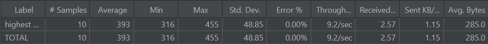

Nama: Bastian Adiputra Siregar\
NPM: 2306245005\
Kelas: Pemrograman Lanjut B

    
<b>Modul 5</b>

## JMeter test plan before optimization
#### AllStudentName

#### HighestGpa

## Intellij Before & After Optimization
#### AllStudentWithCourses()
##### before

##### after

#### joinStudentName()
##### before

##### after

#### findStudentWithHighestGpa()
##### before

##### after

## Re-measurement After Performance Optimization 
#### AllStudentName

Berdasarkan hasil pengujian sebelum dan sesudah optimasi pada kedua endpoint, terlihat bahwa setelah dilakukan optimasi terjadi peningkatan signifikan pada performa sistem. Pada endpoint "highest GPA", rata-rata waktu respon turun dari 2871 ms menjadi 931 ms, throughput meningkat dari 2.9/sec menjadi 6.2/sec, serta jumlah data yang diterima meningkat drastis dari 872.64 KB/sec menjadi 16620.74 KB/sec. Begitu juga dengan endpoint "all student name", rata-rata waktu respon turun dari 2871 ms menjadi 931 ms, throughput meningkat dari 2.9/sec menjadi 6.2/sec, dan data yang diterima juga melonjak dari 872.64 KB/sec menjadi 16620.74 KB/sec. Dengan demikian, optimasi yang dilakukan berhasil meningkatkan efisiensi dan kecepatan sistem secara signifikan, mengurangi waktu respon dan meningkatkan throughput pada kedua endpoint.

#### HighestGpa

Berdasarkan dua tabel hasil pengujian sebelum dan sesudah optimasi, terlihat adanya peningkatan signifikan pada rata-rata waktu respon. Sebelum optimasi, rata-rata waktu respon adalah 393 ms dengan minimum 316 ms dan maksimum 455 ms, serta deviasi standar 48.85 ms. Setelah optimasi, rata-rata waktu respon turun drastis menjadi 81 ms dengan minimum 73 ms dan maksimum 92 ms, serta deviasi standar lebih kecil yaitu 5.68 ms. Meskipun throughput sedikit meningkat dari 9.2 request per detik menjadi 10.1 request per detik, nilai error tetap 0% di kedua kondisi. Hal ini menunjukkan bahwa optimasi yang dilakukan berhasil meningkatkan performa sistem secara signifikan dengan mengurangi waktu respon dan mempertahankan kestabilan layanan tanpa kesalahan.

# Refleksi

## Apa perbedaan pendekatan performance testing dengan JMeter dan profiling dengan IntelliJ Profiler dalam konteks optimasi performa aplikasi?
Perbedaan utama antara performance testing dengan JMeter dan profiling dengan IntelliJ Profiler ada pada tujuan dan fokusnya. JMeter digunakan untuk mengukur kinerja aplikasi dari sisi eksternal, dengan cara mensimulasikan banyak pengguna yang mengakses aplikasi secara bersamaan. Tujuannya untuk mengetahui seberapa banyak beban (load) yang bisa ditangani aplikasi, respon time, throughput, serta kestabilan sistem di bawah tekanan tertentu.

Sementara itu, IntelliJ Profiler lebih fokus ke analisis internal aplikasi, yaitu bagaimana penggunaan sumber daya (CPU, memory, threads, dan garbage collection) oleh kode yang dijalankan. Profiler membantu mengidentifikasi bottleneck di level metode atau fungsi tertentu dalam kode, seperti metode yang menghabiskan banyak waktu eksekusi atau objek yang menyebabkan memory leak.

## Bagaimana proses profiling membantu kamu dalam mengidentifikasi dan memahami titik lemah dalam aplikasi?
Proses profiling memungkinkan kita untuk melihat dengan jelas bagian mana dari kode yang paling banyak memakan resource, baik itu CPU atau memory. Misalnya, dengan IntelliJ Profiler, kita bisa melihat jika sebuah metode menghabiskan 80% waktu CPU saat aplikasi berjalan, yang berarti metode tersebut perlu dioptimalkan karena menjadi bottleneck.

Selain itu, profiling membantu memahami pattern penggunaan memory, seperti object allocation dan garbage collection. Jika ada indikasi memory leak, profiler menunjukkan class mana yang terus-menerus membuat object tanpa pernah dilepas, sehingga kita bisa melakukan perbaikan di bagian kode tersebut.

## Apakah menurut kamu IntelliJ Profiler efektif dalam membantu menganalisis dan mengidentifikasi bottleneck di kode aplikasi kamu?
Ya, IntelliJ Profiler cukup efektif karena memberikan data yang sangat detail dan visualisasi yang mudah dipahami terkait penggunaan CPU dan memory. Kita bisa langsung tahu metode mana yang lambat, thread mana yang blocking, dan bahkan bisa melihat call tree yang menunjukkan bagaimana alur eksekusi menyebabkan bottleneck tersebut. Contohnya, saat profiling aplikasi dan menemukan metode parsing JSON yang lambat.

Namun, efektivitasnya juga tergantung bagaimana kita memahami data yang ditampilkan dan menginterpretasikan hasilnya secara akurat. Kadang, profiler menunjukkan bottleneck, tapi kita tetap harus cek apakah itu memang masalah utama dari performa aplikasi secara keseluruhan.

## Apa tantangan utama yang kamu hadapi saat melakukan performance testing dan profiling, dan bagaimana kamu mengatasinya?
Salah satu tantangan terbesar saat melakukan performance testing dengan JMeter adalah menyusun skenario testing yang realistis, yang benar-benar mencerminkan kondisi dunia nyata. Misalnya, kita harus menentukan pola traffic, jumlah user, dan request secara akurat agar hasil testing mencerminkan kondisi sebenarnya. Untuk mengatasi ini, ktia bisa menganalisis log production untuk memahami perilaku pengguna sebelum membuat skenario.

Dalam profiling, tantangannya adalah memastikan profiling tidak mengubah perilaku aplikasi, karena profiling kadang bisa menambah overhead yang membuat performa aplikasi terlihat lebih lambat dari seharusnya. Solusinya, bisa menjalankan profiling di environments yang mirip production, dan melakukan profiling sampling, bukan tracing penuh, untuk mengurangi overhead.

## Apa manfaat utama yang kamu dapatkan dari penggunaan IntelliJ Profiler untuk profiling kode aplikasi kamu?
Manfaat utama dari IntelliJ Profiler adalah kemampuan melihat performa aplikasi secara granular, sampai level method dan thread. Kita bisa tahu metode mana yang paling membebani CPU, thread mana yang paling sibuk, dan alokasi memory yang berlebihan. Hal ini mempercepat proses diagnosis dan optimasi, tanpa harus menulis banyak logging atau debugging secara manual.

Selain itu, visualisasi seperti flame graph, call tree, dan allocation view sangat membantu memahami masalah kompleks dalam waktu singkat. 

## Bagaimana kamu menangani situasi ketika hasil profiling dengan IntelliJ Profiler tidak sepenuhnya konsisten dengan temuan dari performance testing menggunakan JMeter?
Ketika ada perbedaan hasil antara profiling dan performance testing, langkah pertama adalah mengevaluasi skenario dan tools yang digunakan, apakah ada perbedaan dalam pengaturan environment, dataset, atau concurrency level. Misalnya, JMeter bisa menunjukkan latency tinggi karena bottleneck di database, sedangkan profiler hanya fokus ke kode Java, sehingga penting untuk melihat end-to-end view.

Kita menggabungkan kedua hasil analisis, JMeter untuk melihat user experience di level aplikasi, dan IntelliJ Profiler untuk menggali lebih dalam di sisi aplikasi. Jika keduanya tidak sinkron, kita menjalankan tes tambahan, misalnya profiling langsung saat load testing berlangsung, untuk mendapatkan gambaran yang lebih akurat.

## Strategi apa yang kamu terapkan dalam mengoptimasi kode aplikasi setelah menganalisis hasil performance testing dan profiling? Bagaimana kamu memastikan perubahan yang kamu lakukan tidak mempengaruhi fungsionalitas aplikasi?
Setelah menganalisis hasil testing dan profiling, strategi utama adalah fokus pada bottleneck yang memberikan dampak paling besar, seperti mengoptimalkan query database yang lambat, refaktor metode yang memakan banyak CPU, atau caching data yang sering diakses. Untuk memastikan perubahan tidak merusak fungsionalitas aplikasi, kita bisa menjalankan suite automated testing (unit test, integration test) setelah refaktor.

